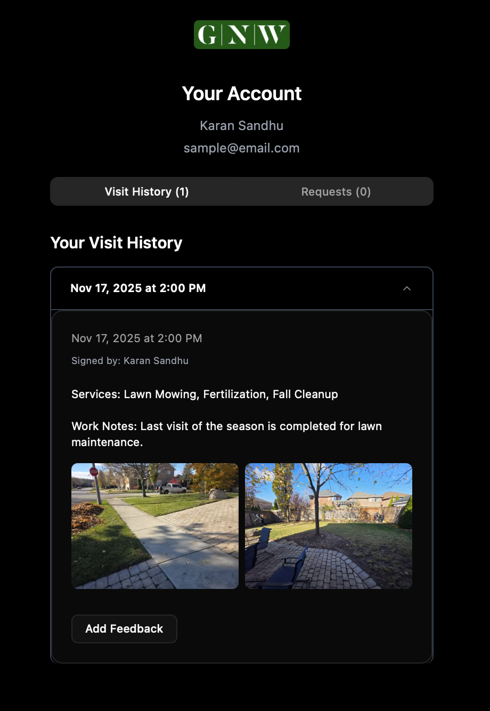
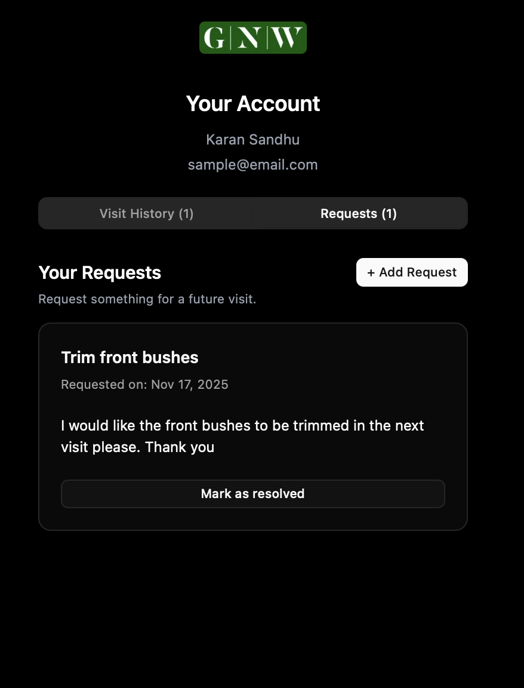
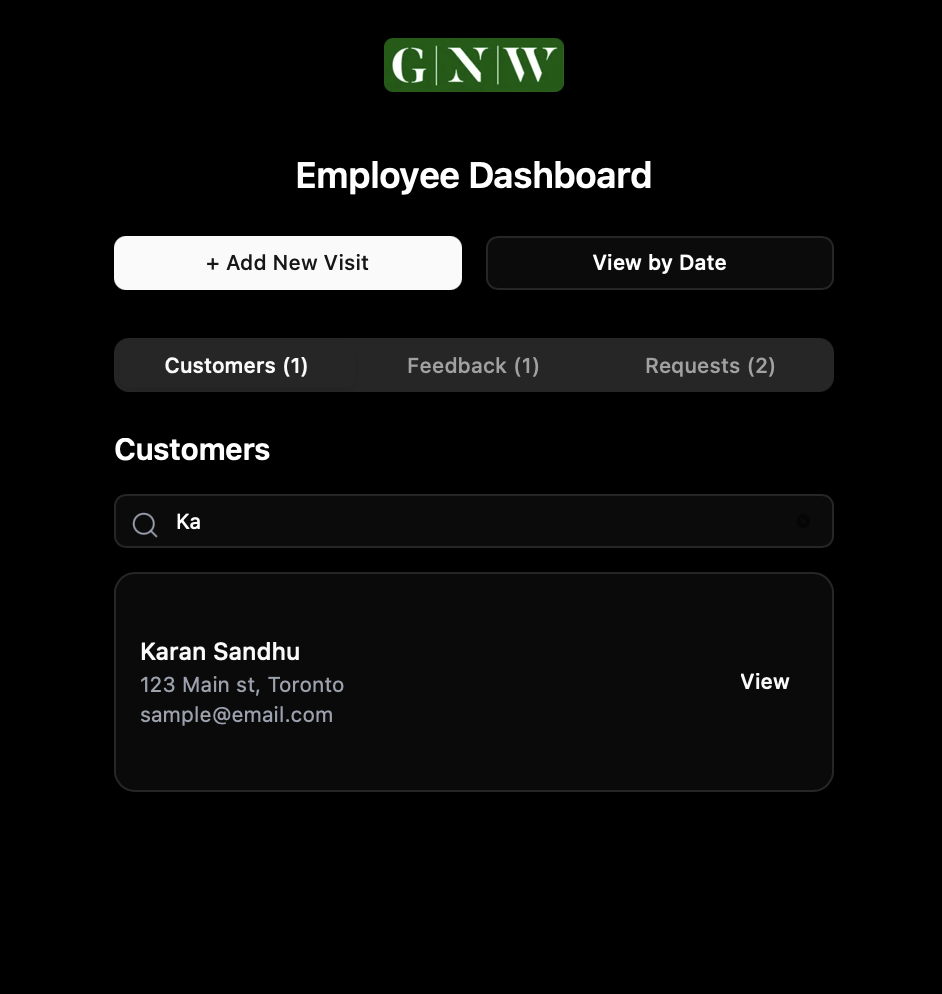
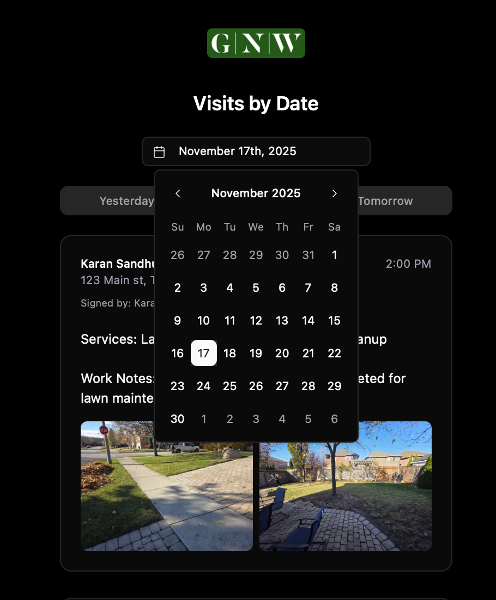
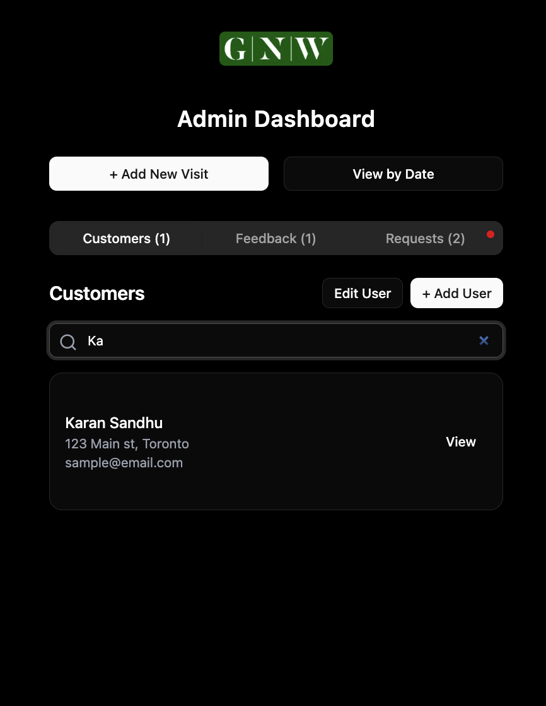
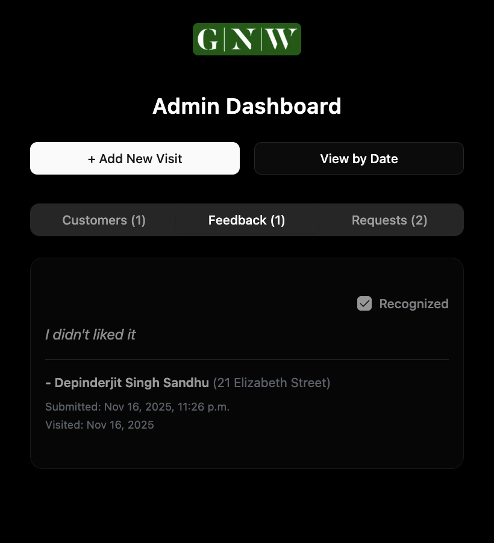
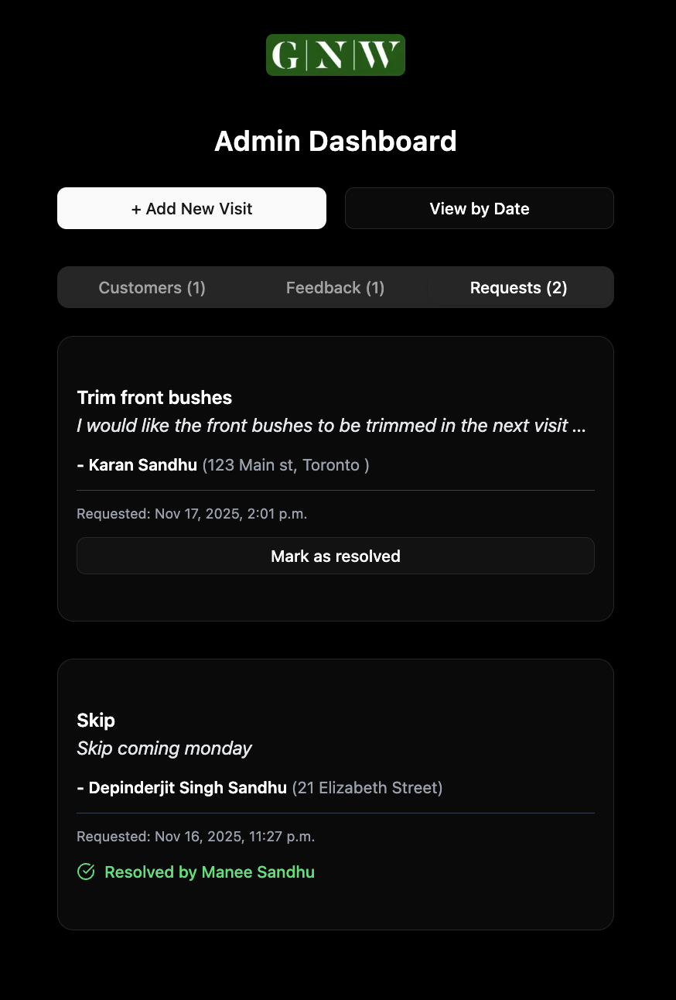

## Overview

This is a visit tracking app for Greenworks Landscaping Inc. Employees add an entry after every visit to a customer after which an email is sent to the customer with the details about the visit. Customer can access that and more through the app. 

### Roles

- #### Customer
  A customer can access their previous visits, provide feedback on those visits and can request future work.
  
<table align="center" border="0" cellpadding="0" cellspacing="0">
  <tr>
    <td align="center">
      
    </td>
    <td align="center">
      
    </td>
  </tr>
</table>

- #### Employee
  An employee can create a visit to a customer, see all customers' visits, feedbacks and requests. Employee can also browse visits by date.
  
<table align="center" border="0" cellpadding="0" cellspacing="0">
  <tr>
    <td align="center">
      
    </td>
    <td align="center">
      
    </td>
  </tr>
</table>

- #### Admin
  An Admin can do what an employee can do + edit/delete user and visits info, recognise feedbacks and resolve requests.
  
<table align="center" border="0" cellpadding="0" cellspacing="0">
  <tr>
    <td align="center">
      
    </td>
    <td align="center">
      
    </td>
    <td align="center">
      
    </td>
  </tr>
</table>


## Requirements

This is a [Next.js](https://nextjs.org) project bootstrapped with [`create-next-app`](https://nextjs.org/docs/app/api-reference/cli/create-next-app).

You would need your database, image store and fetch api, and email api. 

For this project, I use Neon serverless postgres, Cloudinary, and Resend respectively. 

## Getting Started

First, get the dependencies:

```bash
npm install
```
Then, run the development server:

```bash
npm run dev
```

Open [http://localhost:3000](http://localhost:3000) with your browser to see the result.
